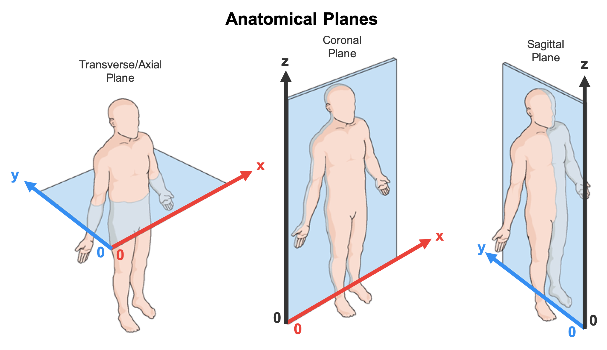

# ALTIS+

Repository of the method ALTIS+. It provides useful material for the paper: Azael Sousa et al., "**ALTIS: A Fast and Automatic Lung and Trachea CT-Image Segmentation Method**", Medical Physics Journal 2019, and Azael Sousa et al., "**Improving Automated Lung Segmentation in CT Images by Adding Anomalies Adjacent to the Pleura**", IEEE ISBI 2022.

We propose a method called ALTIS+ that uses only image processing operators based on optimum connectivity to segment the volume of air of both lungs and trachea separately in CT images of the thorax. It is an extension of the original ALTIS algorithm adapted to include pleural anomalies in the segmentation mask.

## Materials

ALTIS was evaluated in a large set of CT images gathered from different public datasets. For each dataset, the gold-standard used in the experiments is provided in the `nii.gz` format.

- *VIA/ELCAP*, the data can be downloaded [here](http://www.via.cornell.edu/lungdb.html). The gold-standard is located at `Materials/via_elcap.zip` in this repository.
- *EXACT09*, the data can be downloaded [here](http://image.diku.dk/exact/). The gold-standard is located at `Materials/exact09.zip` in this repository.
- *LOLA11*, the data can be downloaded [here](https://lola11.grand-challenge.org/). To download the images, one must first register in the competition. The gold-standard is located at `Materials/lola11.zip` in this repository.
- *LIDC IDRI*, the data can be downloaded [here](https://wiki.cancerimagingarchive.net/display/Public/LIDC-IDRI). The gold-standard is located at `Materials/lidc_idri_part1.zip` and `Materials/lidc_idri_part2.zip` in this repository. The data has been separated into 2 parts because its size exceeded 100MB.

ALTIS+ was evaluated on a smaller in-house dataset. Experiments showed that ALTIS+ has almost no impact on the areas segmented by ALTIS.

## Dependencies

Before running ALTIS+, one must install its dependencies. ALTIS+ requires the shared libraries libatlas, liblapack and libblas. For that, just run the following command on the terminal:

```
sudo apt-get install libatlas-base-dev
```

## Implementation

The implementation of ALTIS+ is located at the folder `bin/` of this repository. It is the 64-bit binary version for Ubuntu 20.04. In order to run the software, just run the following commands.

```
$cd <path_to_ALTIS_binary>
$chmod +x iftALTIS
$./iftALTIS -i <input_ct_image> -o <output_label_mask>
```

The file formats accepted by the software are: `.nii`, `.nii.gz`, `.hdr`, `.scn`. If some parts of the lungs are left unsegmented, add the flag `--improve-segmentation 25` as shown bellow. It will perform an extra delineation step to try to solve this problem. To see all available flags of this software, just add the flag `-h` or `--help`.

```
$./iftALTIS -i <input_ct_image> -o <output_label_mask> --improve-segmentation 25
```

---

### Extra Requirements:
- The input image must be **isotropic**: the voxel size is the same in every dimension.
- The considered *patient orientation* in the CT scan must be (see image below):
    - from inferior to superior along the axial slices (z-axis);
    - from right to left along the sagittal slices (x-axis); and
    - from anterior to posterior along the coronal slices (y-axis).




Therefore, in a coronal slice, the lungs and trachea appear in the upright position, being the right lung on the left side of the slice. Otherwise, the method may not run correctly.

If a NIfTI image (`.nii`, `.nii.gz`) is provided, the program automatically rotates it according to the considered anatomical directions.

## Docker

If prefered, there are docker images with ALTIS, ALTIS+ and all basic dependencies already installed available at DockerHub under the repository lidsunicamp/altis_docker (https://hub.docker.com/r/lidsunicamp/altis_docker). Inside the image container, one can call the ALTIS program at any folder using the command line:

```
$iftALTIS -i <input_ct_image> -o <output_label_mask>
```
or
```
$iftALTIS+ -i <input_ct_image> -o <output_label_mask>
```

The ALTIS+ method is available from version 1.2 onward. Additionally, the docker provides support softwares for normalization and interpolation. For instance, to make the input image isotropic with voxel size of 1x1x1mm3, run the command: 

```
$iftInterp <input_ct_image> VOXEL 1. 1. 1. <output_label_mask>
```

In its turn, to normalize the input image to the range [0,4095] (standard 12 bits storage of medical images), one may run the command:

```
$iftNormalizeImage -i <input_ct_image> -a 0 -b 4095 -o <output_label_mask>
```

## Contact

If you have any questions or suggestions, please send us a message on the e-mail azaelmsousa@gmail.com.
